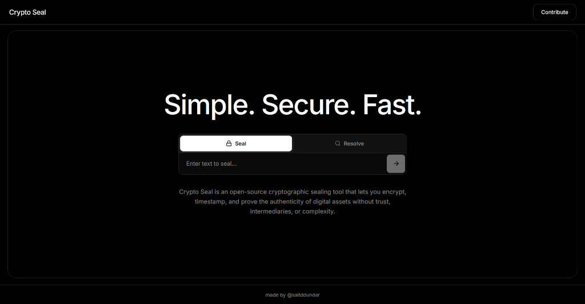

# Crypto Seal

A cryptographic sealing tool that lets you encrypt, timestamp, and prove the authenticity of digital assets — without trust, intermediaries, or complexity.

**Simple. Secure. Fast.**



## Overview

Crypto Seal is an open-source application designed for timestamping and verifying digital content. It generates unique cryptographic hashes for your documents, providing immutable proof of existence at a specific point in time.

## Features

- **Seal** — Generate a cryptographic hash and timestamp for any text
- **Resolve** — Look up existing seals by hash to verify authenticity
- **Minimal UI** — Clean, distraction-free interface

## Tech Stack

- React 19
- TypeScript
- Vite

## Getting Started

```bash
# Install dependencies
npm install

# Start development server
npm run dev

# Build for production
npm run build
```

## Backend

This frontend connects to the Crypto Seal backend API.

**Backend Repository:** [crypto-seal-backend](https://github.com/saitddundar/crypto-seal-backend)

## License

MIT
